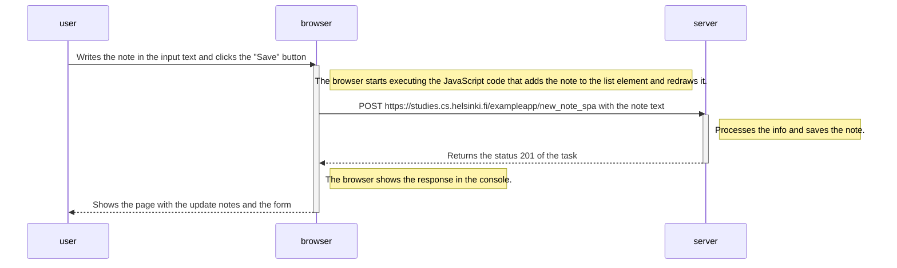

```mermaid
sequenceDiagram
    participant user
    participant browser
    participant server

    user->>browser: Writes the note in the input text and clicks the "Save" button
    activate browser

    Note right of browser: The browser starts executing the JavaScript code that adds the note to the list element and redraws it.

    browser->>server: POST https://studies.cs.helsinki.fi/exampleapp/new_note_spa with the note text
    activate server
    Note right of server: Processes the info and saves the note.   
    server-->>browser: Returns the status 201 of the task
    deactivate server

    Note right of browser: The browser shows the response in the console.
    browser-->>user: Shows the page with the update notes and the form
    deactivate browser
    
```
